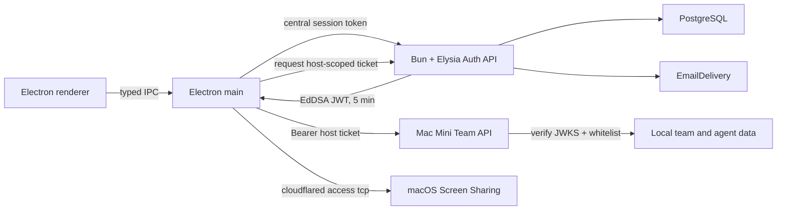

# Plan 001: Add a central account API and a host whitelist

> [!IMPORTANT]
> The backend part of this plan is out of date. Plan
> `002-tanstack-solid-cloudflare-d1-auth.md` replaces Bun + Elysia, PostgreSQL
> and local passwords with TanStack Start, Solid 2, Cloudflare Workers, D1 and
> one-time email codes. The remaining requirements for the host whitelist still
> hold, but they must use the new account API.

> **Instructions for the implementer**: Execute this plan step by step. After
> every step run the command given and confirm the expected result. If a
> condition from the `STOP` section occurs, stop work and report the problem. Do
> not guess. When you are done, set this plan's state to `DONE` in
> `plans/README.md`, unless the reviewer maintains the index themselves.
>
> **Repository change check — do this first**:
>
> ```bash
> git diff --stat 8229759..HEAD -- package.json bun.lock README.md CONTRIBUTING.md electron-builder.yml .github apps src/main src/preload src/renderer packages/contracts/src
> git status --short
> ```
>
> The plan was written at commit `8229759`, but the working tree was dirty. The
> files `src/main/host-service.ts`, `src/main/remote-server-manager.ts`,
> `src/main/team-api-server.ts`, `src/main/team-store.ts` and the new UI
> components were uncommitted. `git diff 8229759..HEAD` alone will not detect
> changes in those files. Compare the "Current state" section against the live
> code as well. If the contracts or the authorization flow differ from the
> description, use the `STOP` condition.

## Status

- **Priority**: P1
- **Size**: L
- **Risk**: HIGH
- **Dependencies**: none
- **Category**: direction, security, migration
- **Planned at**: commit `8229759`, 2026-08-18

## Why this is needed

The current prototype creates accounts, passwords and sessions separately on
every host. The client sends the password straight to the host. That model does
not give one Dani-Dex account and forces every Mac Mini to handle sign-in data.

After this change a separate Bun + Elysia server will own registration, the
unique email, the password and the sessions. The host will store only a local
whitelist and a role for its team. The client will sign in to the central API
once, and the host will accept a short token signed by the central API only when
the verified user is on its whitelist.

## Target architecture



Responsibility boundaries:

- The central API stores: the email, the password hash, email verification,
  central sessions and account recovery tokens.
- The host stores: `serverId`, `email`, the stable `userId`, the role, the
  disabled state, and the team and agent data. The host stores no password, no
  password hash, no salt, no nickname and no central session token.
- The client stores the central session token only through Electron
  `safeStorage`. The client does not store the password. The short host token
  stays in memory only.
- The host's Ed25519 identity, which signs a Quick Tunnel address change, stays
  independent of the central API's Ed25519 key.
- Cloudflare Tunnel and VNC do not change protocol. This plan changes only Team
  API authorization.

## Decisions that must not change during execution

### User identity

The product shows and searches for a user by a unique, verified email. The token
must nonetheless carry an immutable UUID in the `sub` claim. An email can change
or be reused. That is why a whitelist entry has this shape:

```ts
interface HostWhitelistMember {
  id: string;
  userId: string | null;
  email: string;
  role: "owner" | "admin" | "member";
  disabled: boolean;
  createdAt: string;
  updatedAt: string;
}
```

The host allows a pending email to be added before the account exists. On the
first valid connection the host atomically sets `userId` from `sub`. After that
it requires both the `userId` and the email to match. It never rebinds
automatically.

Email normalization: strip leading and trailing whitespace, then lowercase the
ASCII letters. Do not strip dots or `+tag` parts. A mail provider's rules are not
Dani-Dex's identity rules. In the first version accept only ASCII addresses up to
254 characters. A password is between 12 and 128 characters. Do not truncate the
password and do not change its case.

### Central authentication

- Registration requires email verification before a host token is issued.
  Without that an attacker could take over a pending whitelist entry.
- Store the password with the asynchronous
  `Bun.password.hash(password, { algorithm: "argon2id" })`. Bun creates the salt
  automatically. Check it with `Bun.password.verify`.
- A central session has a random 256-bit token. Store only the token's SHA-256 in
  PostgreSQL. Default lifetime: 30 days.
- Login and password recovery responses must not reveal whether an email exists.
- Rate limit registration, login, email verification, password reset and host
  token issuance.

Bun's official password hashing API documents Argon2 and the automatic salt:
[Bun password hashing](https://bun.sh/docs/runtime/hashing). PostgreSQL should be
used through Bun's native tagged queries and transactions:
[Bun SQL](https://bun.sh/docs/runtime/sql).

### The host token

`POST /v1/host-tickets` issues an EdDSA token valid for at most 5 minutes. Use
`@elysia/jwt`. The token and its header must contain:

```ts
interface HostTicketClaims {
  iss: "https://<production-auth-origin>";
  aud: `urn:openbot:host:${string}`;
  sub: string; // immutable central user UUID
  email: string; // normalized and verified
  email_verified: true;
  sid: string; // central session id
  jti: string;
  iat: number;
  nbf: number;
  exp: number;
  typ: "openbot-host-access-v1";
}
```

The JWT header carries `alg: "EdDSA"` and `kid`. The host checks the exact
`issuer`, `audience`, `typ`, `email_verified`, the timing and the signature. The
host does not accept an `issuer`, a JWKS URL or a key from an invite link. Those
values come from trusted application configuration. On an unknown `kid` the host
refreshes JWKS once. JWKS carries the current and the previous key during a
rotation.

The official Elysia plugin supports EdDSA and the standard claims:
[Elysia JWT](https://elysiajs.com/plugins/jwt).

### Whitelisting instead of local invitations

- An owner and an admin add `email + role` to the host whitelist.
- The central API has no "does this email have an account" endpoint. Such an
  endpoint would leak user registrations.
- A server link carries only `apiUrl`, `serverId`, the fingerprint and the host's
  public key. The link carries no secret and no account data.
- The link alone grants no access. The client must have a central session, a
  verified email and a whitelist entry.
- Remove the local host endpoints `/v1/join`, `/v1/auth/login` and
  `/v1/auth/password`. The host does not create a local user session.
- The host may keep a `/v1/auth/me` endpoint, but it returns the identity from a
  valid host token plus the local role. It creates no session.

## Current state

The repository is an Electron application. The `main` process starts local
processes, the host API and `vnc://`. The renderer uses SolidJS. Packages are
installed by Bun 1.3.11. The full quality gate is `bun run check`.

The relevant files and the existing problem:

- `src/main/team-store.ts:23-26` extends a member with `passwordSalt` and
  `passwordHash`.
- `src/main/team-store.ts:130-161` configures the host with a local owner, a
  username and a password.
- `src/main/team-store.ts:207-305` creates local invitations, accepts a password,
  signs in and changes the password.
- `src/main/team-api-server.ts:82-132` exposes `/v1/join`,
  `/v1/auth/login`, logout and a local password change.
- `src/main/remote-server-manager.ts:105-172` sends a username and a password to
  the host, then stores the encrypted host token.
- `packages/contracts/src/ipc.ts:85-116` has `JoinServerInput`, `LoginServerInput` and
  `ConfigureHostInput` with username/password fields.
- `src/renderer/src/components/HostPanel.tsx:75-123` asks for local owner data.
- `src/renderer/src/components/JoinServerDialog.tsx:3-73` asks for the host's
  username and password.
- `README.md` states that Dani-Dex has no backend and no account system. Once this
  ships, that statement will be false.

The current shape that must go away:

```ts
// src/main/team-store.ts:23-26
interface StoredMember extends TeamMemberSummary {
  passwordSalt: string;
  passwordHash: string;
}

// packages/contracts/src/ipc.ts:85-116, abridged
interface JoinServerInput { inviteUrl: string; username: string; password: string }
interface LoginServerInput { serverId: string; username: string; password: string }
interface ConfigureHostInput { serverName: string; username: string; password: string }
```

The repository uses TypeScript, explicit IPC contracts in `packages/contracts/src/ipc.ts`,
Vitest tests next to the modules, and `shell: false` for child processes. Keep
these conventions. Build the Elysia validation from `t.Object` with explicitly
described body, params, headers and response. Do not use unvalidated `unknown` at
the HTTP boundary. See [Elysia validation](https://elysiajs.com/tutorial/getting-started/validation/).

## The central API contract

Every error response has a stable shape:

```ts
interface ApiErrorResponse {
  error: {
    code: string;
    message: string;
    requestId: string;
  };
}
```

The minimum endpoints:

| Method and path | Auth | Input | Result |
|---|---|---|---|
| `POST /v1/auth/register` | none | `{email,password}` | `202`; generic message |
| `POST /v1/auth/verify-email` | none | `{token}` | `204` |
| `POST /v1/auth/login` | none | `{email,password}` | central session token + user |
| `POST /v1/auth/logout` | session | none | `204`; revokes the current session |
| `GET /v1/auth/sessions` | session | none | the user's active sessions |
| `DELETE /v1/auth/sessions/:id` | session | path id | `204`; revokes the named session |
| `POST /v1/auth/password/forgot` | none | `{email}` | `202`; generic message |
| `POST /v1/auth/password/reset` | none | `{token,password}` | `204`; revokes every session |
| `GET /v1/me` | session | none | `CentralUserSummary` |
| `POST /v1/host-tickets` | session | `{hostId}` | `{token,expiresAt}` |
| `GET /.well-known/jwks.json` | none | none | the public JWK, no private key |
| `GET /health/live` | none | none | the process is running |
| `GET /health/ready` | none | none | the DB and the key are ready |

The central API stores no teams, agents, host roles or memberships. Nor does it
check whether a user is on a host's whitelist. The token narrows the `audience`,
but the final decision belongs to the host.

## The central API data schema

Add PostgreSQL migrations for the tables:

```text
users(
  id uuid primary key,
  email_normalized text not null unique,
  password_hash text not null,
  email_verified_at timestamptz null,
  disabled_at timestamptz null,
  created_at timestamptz not null,
  updated_at timestamptz not null
)

auth_sessions(
  id uuid primary key,
  user_id uuid not null references users(id),
  token_hash text not null unique,
  created_at timestamptz not null,
  expires_at timestamptz not null,
  revoked_at timestamptz null,
  last_used_at timestamptz not null
)

email_verification_tokens(
  id uuid primary key,
  user_id uuid not null references users(id),
  token_hash text not null unique,
  expires_at timestamptz not null,
  used_at timestamptz null,
  created_at timestamptz not null
)

password_reset_tokens(
  id uuid primary key,
  user_id uuid not null references users(id),
  token_hash text not null unique,
  expires_at timestamptz not null,
  used_at timestamptz null,
  created_at timestamptz not null
)

auth_rate_limit_buckets(
  key_hash text not null,
  action text not null,
  bucket_started_at timestamptz not null,
  request_count integer not null,
  primary key(key_hash, action, bucket_started_at)
)
```

Add indexes for the active sessions and the expiring tokens. Every one-time token
is 256-bit and only its SHA-256 lives in the database. Perform the "consume the
token" operation in a single transaction with `SELECT ... FOR UPDATE` or an
equivalent atomic condition. Do not store the private signing key in the
database.

## Configuration

`apps/auth-api/.env.example` carries the names, the comments and safe examples
with no secrets:

```text
NODE_ENV=development
PORT=3000
DATABASE_URL=postgres://...
AUTH_ISSUER=http://127.0.0.1:3000
AUTH_SIGNING_KEY=<base64url encoded Ed25519 private key>
AUTH_SIGNING_KEY_ID=<non-secret key id>
AUTH_PREVIOUS_PUBLIC_KEYS_JSON=[]
EMAIL_PROVIDER=resend
EMAIL_FROM=<verified sender>
RESEND_API_KEY=<secret>
APP_DEEP_LINK_ORIGIN=openbot://auth
```

In production `AUTH_ISSUER` must be one exact HTTPS address. The desktop
application has a compiled or managed `AUTH_API_URL` and `AUTH_ISSUER`
configuration. Do not read them from the server link. `localhost` is allowed only
in development and tests.

The API may listen on `0.0.0.0` in a container, because it is a deployed service.
The local Team API on the Mac must still listen on `127.0.0.1` only.

## Commands

| Goal | Command | Expected result |
|---|---|---|
| Input state | `bun --version` | exactly `1.3.11` |
| Install after a dependency change | `bun install` | exit 0 and a changed `bun.lock` |
| API types | `bun run auth:typecheck` | exit 0, no errors |
| API tests | `bun run auth:test` | exit 0, every test passes |
| Test database migrations | `bun run auth:db:migrate` | exit 0, every migration applied once |
| Full gate | `bun run check` | exit 0 |
| Lockfile | `bun install --frozen-lockfile` | exit 0, no change to `bun.lock` |

If the root scripts carry different names after an accepted contract change, fix
this table before writing code. Do not skip the equivalents of these checks.

## Scope

### In scope

- `package.json`, `bun.lock` — the Bun workspace and the API commands.
- `apps/auth-api/package.json`, `apps/auth-api/tsconfig.json` — a separate package.
- `apps/auth-api/src/**` — the Elysia app, auth, tickets, DB, email,
  configuration, logging and rate limiting.
- `apps/auth-api/migrations/**` — versioned PostgreSQL migrations.
- `apps/auth-api/test/**` — unit and integration tests.
- `apps/auth-api/Dockerfile`, `apps/auth-api/.env.example`,
  `apps/auth-api/README.md` — deployment.
- `src/main/central-auth-manager.ts` and its test — the central session in
  Electron main.
- `src/main/team-store.ts` and its test — the v2 whitelist schema.
- `src/main/team-api-server.ts` and its test — token validation and roles.
- `src/main/host-service.ts` and its test — the owner from the central identity.
- `src/main/remote-server-manager.ts` and its test — a host-scoped token instead
  of signing in to the host.
- `src/main/index.ts` — lifecycle and IPC.
- `src/preload/index.ts` — the typed central auth API.
- `packages/contracts/src/ipc.ts` — the public types and events.
- `src/renderer/src/App.tsx`, `src/renderer/src/App.test.tsx` — the account state.
- `src/renderer/src/components/CentralAuthDialog.tsx` and its test —
  registration, login, verification and the account.
- `src/renderer/src/components/HostPanel.tsx` — whitelist email + role.
- `src/renderer/src/components/JoinServerDialog.tsx` — a link with no host credentials.
- `README.md`, `PRIVACY.md` and `SECURITY.md`, if they exist — a truthful
  description of the backend and the data boundaries.
- `.github/workflows/**`, if the repo has CI — the PostgreSQL service and the API
  tests.

### Out of scope

- Moving agents, conversations, files or SSE into the central API.
- Changing the Cloudflare Quick Tunnel, VNC or Screen Sharing protocol.
- Streaming the embedded browser to a remote renderer.
- Payments, multi-host organizations, SSO, OAuth and social login accounts.
- A web admin panel for the central API.
- Installing `cloudflared` automatically or changing macOS settings.
- Changing the agent providers or their local data format.

If a correct implementation needs something out of scope, stop work and report
it. Do not widen the scope on your own.

## Git workflow

- Suggested branch: `codex/001-central-auth-api`.
- Preserve the user's uncommitted changes before creating the branch. Do not use
  `git reset --hard` or `git checkout --`.
- Use small logical commits. The repo uses Conventional Commits, for example
  `feat: add animated Blobatar avatars` and `fix: stabilize avatar picker popover`.
- Do not push and do not open a PR without the operator asking for it.

## Steps

### Step 0: Freeze the threat model and the contract

Create `apps/auth-api/README.md` with the flow diagram and the boundaries
described in this plan. Add a table of the endpoints, the JWT claims, the central
data and the host data. Describe the four assets: passwords, central session
tokens, host tickets and the Ed25519 private key. Describe where each asset may
appear and where it is forbidden.

Define `EmailDelivery` as an interface. The production implementation should use
Resend over an HTTPS `fetch`; the test one should keep the delivered links in
memory only. Do not log a verification or reset token. If the operator picks a
different provider, change only the adapter and the configuration.

**Check**:

```bash
rg -n "password|session|host ticket|Ed25519|EmailDelivery|whitelist" apps/auth-api/README.md
```

Expected result: the document covers all six topics and contains no real secret.

### Step 1: Add the Bun + Elysia package

Add the Bun workspace `apps/auth-api`. The root `package.json` gets the scripts:

```json
{
  "auth:dev": "bun --cwd apps/auth-api run dev",
  "auth:typecheck": "bun --cwd apps/auth-api run typecheck",
  "auth:test": "bun --cwd apps/auth-api run test",
  "auth:db:migrate": "bun --cwd apps/auth-api run db:migrate"
}
```

Add compatible versions of `elysia` and `@elysia/jwt`. Add the OpenAPI plugin
only if its current package is compatible with the installed Elysia. Do not guess
the old package name. Generate OpenAPI for the public routes. Use Vitest as the
existing repo does. The package's `test` script should run `vitest run`.

The minimum structure:

```text
apps/auth-api/
  src/app.ts
  src/index.ts
  src/config.ts
  src/http/errors.ts
  src/http/request-id.ts
  src/auth/
  src/db/
  src/email/
  src/tickets/
  migrations/
  test/
  Dockerfile
  .env.example
  README.md
```

`src/app.ts` exports an application factory and opens no port. `src/index.ts`
reads the validated configuration and starts the listener. That way the tests do
not have to start a child process.

**Check**: `bun install && bun run auth:typecheck` → exit 0, `bun.lock`
contains Elysia, no TypeScript errors.

### Step 2: Add PostgreSQL and versioned migrations

Use `Bun.sql` or `new SQL(DATABASE_URL)` from `bun`. Do not add an ORM. Build a
small repository interface so the unit tests need no DB, but the integration
tests must run against a real PostgreSQL.

Add the tables and indexes from the "Data schema" section. The migrator must:

1. create the `schema_migrations` table;
2. block concurrent migrations with a PostgreSQL advisory lock;
3. run every migration in a transaction;
4. record each migration's name and checksum;
5. abort the start when an applied migration's checksum has changed.

Add a `ready` check that runs `SELECT 1` and confirms the full schema version.

**Check**:

```bash
bun run auth:db:migrate
bun run auth:db:migrate
bun run auth:test -- db
```

Expected result: both migration runs exit 0; the second duplicates nothing; the
tests for the unique constraints, the foreign keys and the one-time token pass.

### Step 3: Implement registration, verification, sessions and password reset

Build the endpoints from the contract table. Describe every request and response
with Elysia `t.Object`. Add maximum lengths and forbid additional fields.

Requirements:

- The database enforces email uniqueness. A race between two registrations must
  not create two accounts.
- Use explicit Argon2id. Do not use synchronous hashing in a handler.
- Generate the session token and the one-time tokens with a cryptographic RNG.
- Store only the token's SHA-256 in the DB. Compare in constant time when the
  result is not settled by a unique lookup.
- Registration and reset return a generic message regardless of whether the email
  exists.
- Login does not work for an unverified or disabled account.
- A password reset invalidates every session of the user.
- The rate limiter keys on at least IP + normalized email, uses a sliding window
  and a testable clock. Store the bucket in PostgreSQL so the limit holds across
  several API instances. Store a hash of the key in the database, not the raw
  IP + email. Do not store the password or a token in the key or the log. Add
  periodic removal of expired buckets.
- Structured logs carry `requestId`, the method, the path without the query, the
  status and the duration. They carry no body, no `Authorization`, no cookies and
  no full deep link URL.
- Do not add a global CORS `*`. Electron main needs no CORS. If a web client
  appears later, it gets its own list of trusted origins.

**Check**: `bun run auth:test -- auth` → every case for registration,
normalization, verification, Argon2id, login, rate limiting, logout, reset and
revocation passes.

### Step 4: Add Ed25519, JWKS and the host-scoped token

Read the private key from an environment secret. Check the algorithm and the
public key at startup. If the key is wrong, `ready` must return an error and the
API must not issue tokens.

Add:

- `GET /.well-known/jwks.json` with the current public key and the previous
  public keys;
- `POST /v1/host-tickets`, which requires an active central session and a
  verified user;
- the claim set from the "The host token" section;
- a TTL of at most 5 minutes and a small `nbf` skew;
- a random `jti`; an `aud` derived only from a validated `hostId`;
- OpenAPI with no real token examples.

Do not put the private key into the Docker image, the repository, the database,
the logs or OpenAPI.

**Check**: `bun run auth:test -- tickets` → the tests for the EdDSA signature,
`kid`, the issuer, the audience, expiration, `nbf`, the type, an unverified email
and key rotation pass.

### Step 5: Add the central session to Electron main

Create `src/main/central-auth-manager.ts`. The manager is responsible for:

- register, verify email, login, logout, `me`, list/revoke session;
- password reset;
- fetching the host token for a `serverId`;
- storing the central session token through `safeStorage`;
- deleting the stored token after a logout or a 401 response;
- holding the password only for the scope of a single request;
- a fixed, trusted `AUTH_API_URL` and no HTTPS downgrade in production.

Add typed IPC in `packages/contracts/src/ipc.ts`, a handler in `src/main/index.ts` and the
preload methods in `src/preload/index.ts`. The renderer does not fetch the
central API directly.

Extend the existing single-instance and deep link handling with:

```text
openbot://auth/verify-email?token=<one-time-token>
openbot://auth/reset-password?token=<one-time-token>
```

Handle the link on a cold start and in a running application. The parser may pass
the token to `CentralAuthManager` and nowhere else. Do not log the full link, the
query or the token. Remove the token from the UI state once it has been used. Add
tests for a malformed URL, a wrong scheme, a duplicate use and a hand-off from a
second instance.

The target types:

```ts
interface CentralUserSummary {
  id: string;
  email: string;
  emailVerified: boolean;
}

type CentralAuthState =
  | { status: "signed_out" }
  | { status: "verification_required"; email: string }
  | { status: "signed_in"; user: CentralUserSummary }
  | { status: "error"; code: string; message: string };
```

Add a state change event. Do not send the session token to the renderer.

**Check**: `bun run test -- src/main/central-auth-manager.test.ts` → the tests for
storage, 401, logout, the absence of the token in the renderer payload and log
redaction pass.

### Step 6: Move TeamStore to the v2 whitelist

Remove the local sign-in data and sessions from the host. The new team file is
version 2 and carries only the host configuration, the Ed25519 host identity and
the whitelist.

Change `TeamMemberSummary` to the fields `id`, `userId`, `email`, `role`,
`disabled`, `createdAt` and `updatedAt`. Remove the username from the host data.
Add the operations:

- `configure(serverName, ownerCentralUser)`;
- `addWhitelistEmail(actor, email, role)`;
- `bindWhitelistIdentity(email, userId)`, atomically and only when `userId` is null;
- `listMembers`, `setRole`, `setDisabled`, `removeMember`;
- protection of the last owner;
- a ban on an admin modifying the owner.

The file keeps mode `0600`. Every write is atomic. After the v2 write, run a test
that reads the file back and looks for the forbidden fields and for known test
passwords.

Host setup takes the `CentralUserSummary` from the manager. `ConfigureHostInput`
carries only `serverName`. If the central user is not signed in and verified,
setup ends with an actionable error.

**Check**:

```bash
bun run test -- src/main/team-store.test.ts src/main/host-service.test.ts
rg -n "passwordHash|passwordSalt|nickname|username" src/main/team-store.ts src/main/host-service.ts
```

Expected result: the tests pass; `rg` finds no forbidden fields in the production
code of those modules.

### Step 7: Replace host auth with token and whitelist verification

In `src/main/team-api-server.ts` add a `HostTicketVerifier` with a fetch adapter
and a testable clock. The verifier:

1. accepts only `Authorization: Bearer <token>`;
2. reads `kid`, but does not trust `alg` from the token;
3. selects only an Ed25519 key from the trusted JWKS;
4. checks the signature, the exact issuer, the host's exact audience, `typ`,
   `sub`, the normalized email, `email_verified`, `iat`, `nbf`, `exp`, `sid` and
   `jti`;
5. refreshes JWKS once for an unknown `kid`, then rejects the token;
6. looks the whitelist up by `userId`, and for a pending entry by the normalized
   email;
7. atomically binds a pending entry to `sub`;
8. returns the local role to the existing owner/admin/member guards.

The JWKS cache has a time limit, a response size limit and stale-while-error only
for a previously valid, unexpired key. Do not let a client point at a different
JWKS URL.

Remove the local join/login/password endpoints and the host session management.
Keep `/v1/auth/me` as a read of the identity from the token and the whitelist.
The role rules for agents, SSE and files stay local.

**Check**: `bun run test -- src/main/team-api-server.test.ts` → the tests for a
valid token and for a bad signature, issuer, audience, `kid`, type, timing,
email, a missing whitelist entry, a disabled entry and the first bind pass.

### Step 8: Move the remote client to the host-scoped token

In `src/main/remote-server-manager.ts` remove the direct sign-in to the host and
the locally stored host session token. A stored server carries:

```ts
interface StoredRemoteServer {
  id: string;
  name: string;
  apiUrl: string;
  fingerprint: string;
  publicKey: string;
  vncHostname?: string;
}
```

Before every host request the manager fetches a valid ticket for the `serverId`
from `CentralAuthManager`. It may cache one in memory until `exp - 30 s`. It never
writes a ticket to a file. After a 401 from the host it refreshes the ticket at
most once. For SSE it fetches a new ticket on every reconnect. An operation
already in flight keeps its own `serverId`.

`JoinServerInput` carries only the server link. Remove `LoginServerInput` and the
host-login methods from IPC, preload and the UI. The link parser still checks the
host's signed identity and the fingerprint. The link carries no central token and
no email.

**Check**:

```bash
bun run test -- src/main/remote-server-manager.test.ts
rg -n "LoginServerInput|/v1/auth/login|encryptedSessionToken|sessionToken" src/main/remote-server-manager.ts packages/contracts/src/ipc.ts src/preload/index.ts
```

Expected result: the tests pass; `rg` finds neither the removed host-login nor a
host token written into the configuration.

### Step 9: Change the account, host and join UI

Add a `CentralAuthDialog` with four simple views: registration, email
confirmation required, login and the account. Do not show or store the token.

Change the existing views:

- `HostPanel`: setup asks only for the server name. It shows the owner's email
  from the central state. The team section has "Add person", the email, the role,
  a pending or active state, and disable/remove. Remove the local password
  fields, the username, the invitations with a secret and the local host
  sessions.
- `JoinServerDialog`: accepts only the host link. If the user is not signed in
  centrally, it opens `CentralAuthDialog`. After the login it continues the
  connection. It does not ask for macOS/VNC data.
- The server rail: a remote server's state depends on the central session and the
  host's availability. A whitelist error reads "This email has no access to this
  host".

Keep the existing Dani-Dex layout and styles. Do not rebuild the chat in this
plan.

**Check**:

```bash
bun run test -- src/renderer/src/App.test.tsx src/renderer/src/components/CentralAuthDialog.test.tsx
```

Expected result: the tests cover signed-out, verification-required, login, owner
setup from the current email, adding a whitelist entry, and joining without a
host password.

### Step 10: Add a safe migration of the host data

First establish whether the current team v1 format was ever released to users.
Check the tags, the release notes and the artifact versions. Do not conclude
anything from the files merely being uncommitted.

If v1 was not released, the parser may show a readable error for a local
prototype file and let the developer delete it by hand.

If v1 was released, add an explicit `migration_required` state:

1. Do not start the public Team API before the migration.
2. The owner signs in once with the old local password and with the central
   account.
3. After a successful verification, store the owner as a central `userId + email`.
4. Add the other members again by email. An old username is not identity enough.
5. Write v2 atomically, removing every password hash, salt, invite secret and
   local session.
6. Invalidate the old client tokens. Every client signs in centrally.
7. Keep a backup only with the owner's explicit consent, and warn that it holds
   the old password hashes. Set it to `0600`.

**Check**: `bun run test -- src/main/team-store.test.ts -t migration` → v1 does not
start publicly; a correct migration produces a v2 with no forbidden fields; a
wrong old password does not change the file; an interrupted write leaves a valid
v1 or v2.

### Step 11: Add deployment, CI and privacy documentation

Add a minimal, non-root Dockerfile for `apps/auth-api`. The healthcheck uses
`/health/ready`. The image contains no `.env`, no private key and no test files.

CI starts the PostgreSQL service, runs the migrations, `auth:typecheck`,
`auth:test` and the root `bun run check`. It does not connect to a real email
provider. The test adapter captures the link in memory.

Change the root documents:

- `README.md`: drop the claim that Dani-Dex has no backend and no account system.
- `PRIVACY.md`: separate the central data from the local host data. Describe the
  email, the security logs, the retention periods and the account deletion
  process.
- `SECURITY.md`: describe reporting a key leak, JWT key rotation, session
  revocation and the trusted issuer/JWKS.
- `apps/auth-api/README.md`: local start, migrations, the required env, DB
  backup, key rotation and the smoke test.

**Check**:

```bash
bun install --frozen-lockfile
bun run auth:typecheck
bun run auth:test
bun run check
```

Expected result: every command exits 0; the lockfile does not change; the tests
send no email and do not connect to Cloudflare.

### Step 12: Run the full flow test

Add an integration test against a real PostgreSQL and a local Team API on
`127.0.0.1`:

1. The owner registers and verifies a central account.
2. The owner signs in and creates a host with a server name.
3. The owner adds a member's email to the whitelist.
4. The member registers and verifies a central account.
5. The member signs in and fetches a ticket with this host's audience.
6. The host binds the pending email to `sub` and allows `/v1/auth/me` to be read.
7. The member creates an agent, a message, an SSE event and an attachment within
   the role's scope.
8. The owner disables the member. The next request with the same, still valid
   ticket must get a 403 immediately.
9. A ticket for a different `hostId` must get a 401.
10. A central logout blocks the issuing of a new ticket. The old ticket expires
    after at most 5 minutes; the test uses a controlled clock, not `sleep`.

A manual test on two Macs additionally confirms VNC. Team auth and the macOS VNC
credentials stay separate. No macOS password ever reaches the central API.

**Check**: `bun run auth:test -- e2e && bun run check` → exit 0; the whole flow
passes without external Cloudflare and without a real email provider.

## Test plan

### The central API

- Email: trim, lowercase, duplicate race, Unicode and over-long data.
- Password: Argon2id, no plaintext in the DB or the logs, a wrong password, reset
  and revocation.
- Verification: single-use, expiry, retry, a non-existent email without
  enumeration.
- Session: token randomness, hash-only in the DB, expiry, logout, list/revoke.
- Rate limit: IP, email, window reset, a testable clock.
- Ticket: EdDSA, the claims, `kid`, rotation, wrong issuer/audience/type/time.
- HTTP: Elysia schema 422, a stable error body, the request ID, body limits.
- DB: idempotent migrations, checksums and atomic token consumption.

### The host and Electron

- A pending whitelist email binds to a `userId` exactly once.
- The same email with a different `sub` is rejected after the bind.
- A disabled member is rejected immediately.
- An admin does not modify the owner; a member does not manage the whitelist.
- The JWKS cache does not trust a URL from the request and handles rotation
  correctly.
- The central session token lives only in `safeStorage`; the renderer never sees
  it.
- A host ticket lives only in memory and has a separate `aud` per `serverId`.
- An SSE reconnect fetches a new ticket.
- Join, host setup and the UI carry no local password or username.

### Log safety

Add a test with markers for the password, the central session token, the host
ticket, the verification token, the reset token and the full deep link. Run every
operation through the test logger. No marker may appear in the log.

## Completion criteria

Every condition must hold:

- [ ] `bun --version` returns `1.3.11`.
- [ ] `bun install --frozen-lockfile` exits 0 and does not change `bun.lock`.
- [ ] `bun run auth:typecheck` exits 0.
- [ ] `bun run auth:test` exits 0 against a real PostgreSQL in CI.
- [ ] `bun run check` exits 0.
- [ ] The central API runs as a separate Bun + Elysia package.
- [ ] The database has a unique constraint on the normalized email.
- [ ] An account gets no host ticket before its email is verified.
- [ ] The host ticket carries EdDSA, `kid`, `sub`, `email`, an exact `iss`, a
      host-specific `aud` and a TTL of no more than 5 minutes.
- [ ] The host accepts no JWKS URL, issuer or key from a user's link.
- [ ] The host stores only the `userId`, the email, the role and the whitelist
      state.
- [ ] `rg -n "passwordHash|passwordSalt" src/main/team-store.ts` returns nothing.
- [ ] `rg -n "LoginServerInput|/v1/join|/v1/auth/login|/v1/auth/password" src`
      returns nothing for production host auth.
- [ ] `rg -n "username|nickname" src/main/team-store.ts src/main/host-service.ts`
      returns nothing.
- [ ] The central session token never reaches a renderer payload.
- [ ] The host ticket is not written into the server configuration or to disk.
- [ ] The redaction test finds no passwords and no tokens in the logs.
- [ ] Disabling a member on the host blocks the current ticket immediately.
- [ ] The old host-login protocol has a safe migration, or a confirmed absence of
      a production release.
- [ ] `README.md`, the privacy and the security docs describe the central backend
      as the code does.
- [ ] VNC/cloudflared is unchanged beyond the necessary hand-off of the auth
      state.
- [ ] This plan's state is `DONE` in `plans/README.md`.

## STOP conditions

Stop work and report the problem if:

- The Dani-Dex Remote files are missing, or their contracts do not match the
  "Current state" section. They are uncommitted, so the drift risk is high.
- The current local account system was released to users, but there is no
  decision about migrating v1 to v2. Do not delete data silently.
- No production email provider or verified sender domain has been picked before
  the production deployment. You may finish the adapter and the tests, but do not
  mark the production deployment as ready.
- The current `@elysia/jwt` does not support the required EdDSA and `kid`
  configuration on a compatible Bun/Elysia version. Do not replace it with HMAC
  without a security decision.
- The deployment environment provides no PostgreSQL, no TLS or no secure secret
  storage for the private key.
- The requirement changes such that the central API is to store team memberships,
  agents or roles. That is a different system boundary and needs a new plan.
- The requirement forces a password, a nickname or a central session token to be
  stored on the host.
- A correct change requires rebuilding the VNC/cloudflared protocol or opening
  the local port publicly.
- Any verification gate fails twice after a reasonable fix.
- The implementation requires a destructive data change without a transaction and
  a backup.

## Maintenance notes

- Rotate the central Ed25519 key by publishing the new and the previous public
  JWK. Publish the new public key first, then start signing with the new `kid`,
  and remove the previous one only after the maximum TTL and the cache time.
- An email change requires re-verification. The host identifies the bound entry
  by `userId`. Update the email on the host only after a valid token with the
  same `sub`.
- Disabling an account globally stops new tickets from being issued. A ticket
  already issued may work for up to 5 minutes. If the product needs immediate
  global revocation, it needs online introspection or a denylist push. Do not add
  that without a separate decision about the system's availability.
- A host-local disable takes effect immediately, because every request checks the
  local whitelist.
- The reviewer should pay particular attention to the absence of tokens in the
  logs, the exact audience, the trusted JWKS source, the v1 migration and the
  absence of host credentials in IPC.
- The central API is a new operational service. It needs PostgreSQL backups,
  readiness alerts, rate limit metrics and a secret rotation procedure before it
  goes public.
